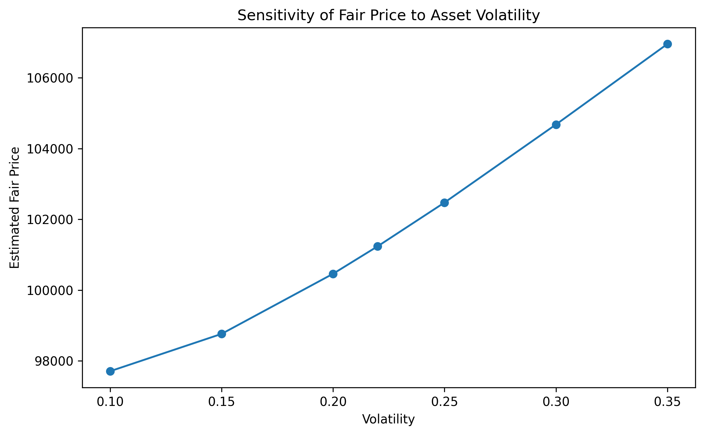
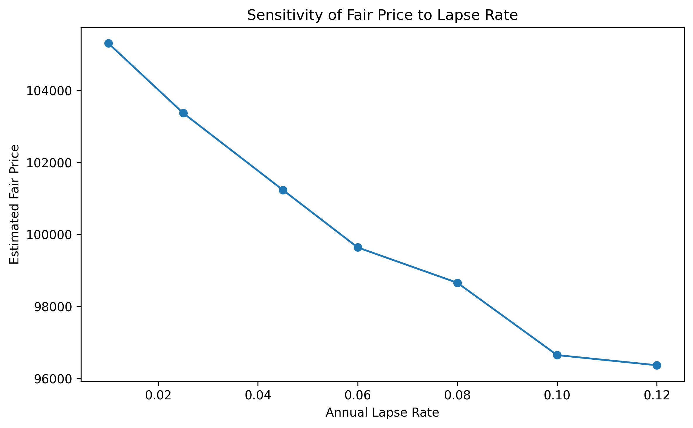
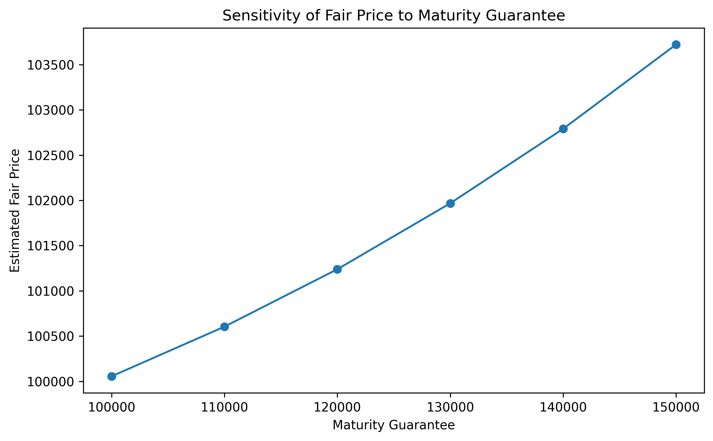
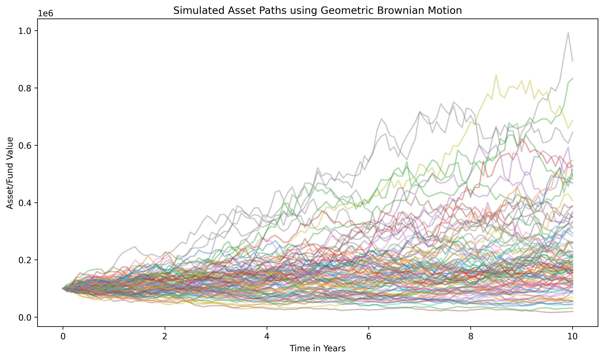
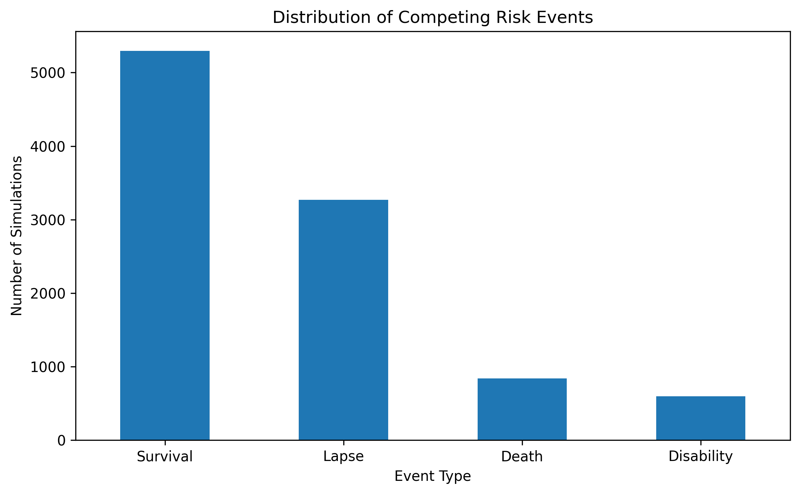
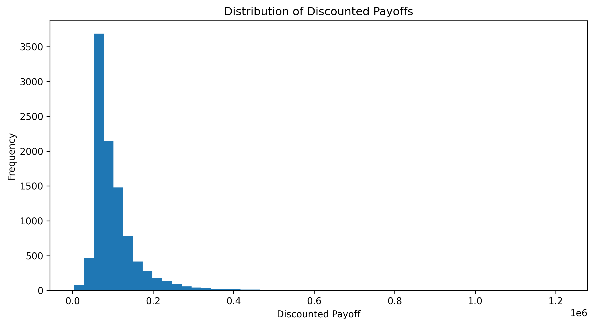
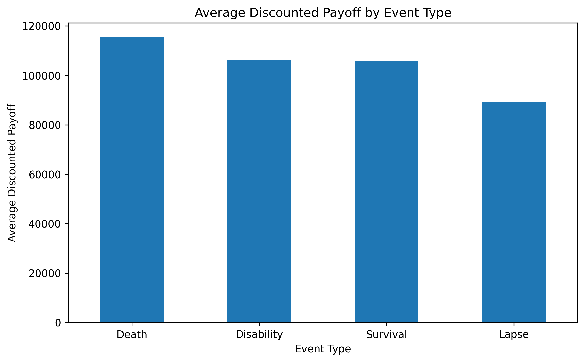

# Equity-Linked Insurance Pricing under Competing Risks

This project implements a stochastic pricing engine for an equity-linked life insurance product using concepts from quantitative finance, actuarial science, and data science.

The model combines:

* Geometric Brownian Motion for stochastic market simulation
* Monte Carlo simulation for pricing uncertain future cashflows
* Competing risks for insurance events such as death, lapse, disability, and survival
* Black-Scholes option pricing as a benchmark for the embedded maturity guarantee
* Sensitivity analysis for market and insurance assumptions
* Model validation against an analytical benchmark

The project is designed as a practical learning and portfolio project showing how financial mathematics and insurance risk modelling can be combined in Python.

---

## Project Overview

The product being priced is an equity-linked insurance contract.

The policyholder is exposed to an investment fund whose value evolves stochastically over time. The contract also includes insurance-style benefits that depend on the first event experienced by the policyholder.

The possible events are:

| Event      | Description                                               |
| ---------- | --------------------------------------------------------- |
| Death      | The policyholder dies before maturity                     |
| Lapse      | The policyholder cancels the policy before maturity       |
| Disability | The policyholder becomes disabled before maturity         |
| Survival   | The policyholder survives to the end of the contract term |

These events are treated as competing risks. This means that the first event to occur determines the policy outcome.

---

## Product Payoff Structure

The product pays different benefits depending on the event outcome.

| Event      | Payoff                                       |
| ---------- | -------------------------------------------- |
| Death      | Maximum of death benefit and fund value      |
| Lapse      | Fund value after surrender charge            |
| Disability | Maximum of disability benefit and fund value |
| Survival   | Maximum of maturity guarantee and fund value |

The maturity benefit is:

```text
max(S_T, G)
```

where:

* `S_T` is the fund value at maturity
* `G` is the guaranteed maturity amount

This payoff contains an embedded option-like guarantee.

---

## Financial Market Model

The fund value is simulated using Geometric Brownian Motion.

The continuous-time model is:

```text
dS_t = rS_tdt + sigma S_tdW_t
```

where:

| Symbol  | Meaning                 |
| ------- | ----------------------- |
| `S_t`   | Fund value at time t    |
| `r`     | Risk-free interest rate |
| `sigma` | Asset volatility        |
| `W_t`   | Brownian motion         |

The discrete simulation formula is:

```text
S(t+dt) = S(t) * exp((r - 0.5*sigma^2)dt + sigma * sqrt(dt) * Z)
```

where `Z` is a standard normal random variable.

---

## Competing Risks Model

The model includes three active insurance decrements:

* Death
* Lapse
* Disability

If no decrement occurs before maturity, the policyholder is classified as a survival case.

The event probabilities are derived from annual risk intensities. The total competing risk intensity is used to determine whether an event occurs at each time step, and the specific event type is selected according to the relative risk weights.

---

## Model Outputs

The pricing engine estimates the fair value of the insurance product as the expected discounted value of future cashflows.

For the current assumptions, the estimated result is approximately:

| Metric                     |       Value |
| -------------------------- | ----------: |
| Estimated fair price       | R101,238.85 |
| Monte Carlo standard error |     R635.49 |
| Contract term              |    10 years |
| Initial asset value        |    R100,000 |
| Risk-free rate             |          8% |
| Volatility                 |         22% |

The event distribution from the simulation is approximately:

| Event Type | Percentage |
| ---------- | ---------: |
| Survival   |     52.96% |
| Lapse      |     32.68% |
| Death      |      8.38% |
| Disability |      5.98% |

---

## Black-Scholes Benchmark

The maturity guarantee can be decomposed as:

```text
max(S_T, G) = S_T + max(G - S_T, 0)
```

This means the guarantee component behaves like a European put option.

The project therefore includes a Black-Scholes benchmark for the embedded guarantee.

Current benchmark result:

| Metric                        |       Value |
| ----------------------------- | ----------: |
| Embedded guarantee value      |   R5,061.11 |
| Guaranteed maturity benchmark | R105,061.11 |

This benchmark is not a replacement for the full insurance pricing engine. It only values the maturity guarantee under financial market assumptions and does not include death, lapse, disability, or surrender benefits.

---

## Model Validation

The Monte Carlo maturity guarantee valuation was validated against the Black-Scholes analytical benchmark.

| Metric                               |       Value |
| ------------------------------------ | ----------: |
| Monte Carlo maturity guarantee value | R105,624.82 |
| Black-Scholes benchmark value        | R105,061.11 |
| Absolute difference                  |     R568.72 |
| Percentage difference                |       0.54% |
| Monte Carlo standard error           |     R755.40 |

The absolute difference is smaller than the Monte Carlo standard error, indicating that the simulation engine produces results consistent with the analytical Black-Scholes benchmark.

---

## Sensitivity Analysis

The project includes sensitivity analysis for key assumptions.

### Volatility Sensitivity

The fair price increases as asset volatility increases. This is expected because the maturity guarantee behaves like an embedded option. Higher volatility increases the value of option-like payoffs.



### Lapse Rate Sensitivity

The fair price decreases as the lapse rate increases. This is because more policies exit early and receive surrender values instead of reaching maturity and potentially receiving the guaranteed maturity benefit.



### Maturity Guarantee Sensitivity

The fair price increases as the guaranteed maturity benefit increases. This reflects the increasing value of the embedded guarantee.



---

## Visual Outputs

### Simulated Asset Paths



### Competing Risk Distribution



### Discounted Payoff Distribution



### Average Payoff by Event



---

## Repository Structure

```text
equity-linked-insurance-pricing-competing-risks/
│
├── main.py
├── requirements.txt
├── README.md
│
├── src/
│   ├── __init__.py
│   ├── config.py
│   ├── market_model.py
│   ├── competing_risks.py
│   ├── product.py
│   ├── pricing_engine.py
│   ├── black_scholes.py
│   ├── sensitivity_analysis.py
│   ├── model_validation.py
│   ├── export_results.py
│   └── visualisations.py
│
├── outputs/
│   ├── figures/
│   └── results/
│
└── docs/
```

---

## How to Run the Project

Clone the repository:

```bash
git clone <repository-url>
cd equity-linked-insurance-pricing-competing-risks
```

Install the required packages:

```bash
pip install -r requirements.txt
```

Run the pricing engine:

```bash
python main.py
```

The script will:

1. Simulate market paths using Geometric Brownian Motion
2. Simulate competing insurance risks
3. Calculate product cashflows
4. Estimate the fair price
5. Run Black-Scholes benchmarking
6. Perform model validation
7. Run sensitivity analysis
8. Export CSV results
9. Save model figures

---

## Exported Results

The model exports results to:

```text
outputs/results/
```

Generated CSV files include:

* pricing_summary.csv
* risk_results.csv
* cashflow_results.csv
* event_distribution.csv
* volatility_sensitivity.csv
* lapse_rate_sensitivity.csv
* maturity_guarantee_sensitivity.csv
* black_scholes_validation.csv

Generated figures are saved to:

```text
outputs/figures/
```

---

## Key Concepts Demonstrated

This project demonstrates practical use of:

* Stochastic processes
* Brownian Motion
* Geometric Brownian Motion
* Monte Carlo simulation
* Discounted cashflow valuation
* Black-Scholes option pricing
* Embedded guarantee valuation
* Competing risks
* Insurance decrement modelling
* Sensitivity analysis
* Model validation
* Python-based financial modelling

---

## Disclaimer

This project is for educational and portfolio purposes only. It is not intended for real-world insurance pricing, investment decision-making, regulatory valuation, or financial advice.
